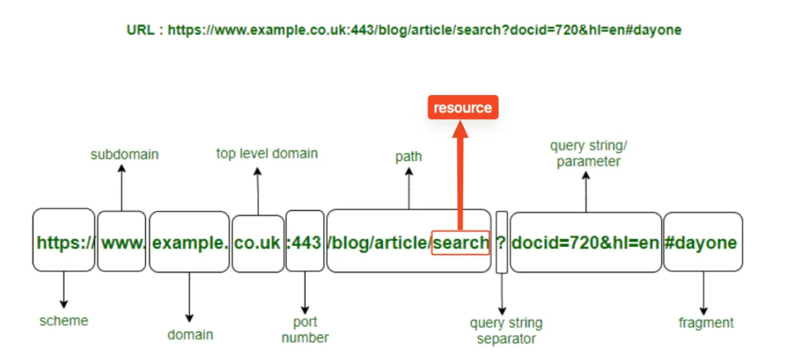

## 📆 2024-11-04

### 🔔 스크럼

- 학습 목표 1 : API Document 작성법
   

### 🚀 Today I Learned

#### | API Document 작성법
`API Document 작성`을 하였고, 피드백을 받은 내용을 공유해 보고자 한다. 

#### 피드백
### /api/users/login, /api/users/signin

로그인과 회원가입이라는 리소스는 “user” 와 관계가 있어보이지만 잘 생각해보면 그렇지 않습니다.

로그인과 회원가입이라는 행동은 “게스트”를 위한 행동이지 “로그인한 유저”의 행동이 아닙니다.

통상적으로 서비스를 이용하는 모든 사람을 유저라고 부르지만 서비스 측면에서 세부적으로 나눠보면 “user” 라는건 누구인지 식별할 수 있는 사람 혹은 단체이어야 한다고 봅니다.

### /api/post/write 와 같이 동사가 포함된 경우

HTTP 요청에는 반드시 HTTP Method 가 포함됩니다.

Method 로 쓸 수 있는 단어는 모두 동사 입니다.

또한 HTTP Request 를 통해 할 수 있는 모든 요청은 GET을 제외하고 모두 데이터를 조작하는 행동입니다.

새로 생성하는 행동, 일부 수정 혹은 전체 수정, 데이터 삭제와 같이 모두 데이터를 수정하는 행동입니다.

조금 어려운 말로 “GET 은 멱등성이 보장된다”라고도 합니다.

따라서 HTTP Method가 있으므로 API path 혹은 resource 에 write, modify, delete 같은 동사는 쓸 필요가 없습니다!

### 🗨️ 오늘의 회고

<!--
- 오늘의 학습 경험에 대한 자유로운 생각이나 느낀 점을 기록합니다.
- 성공적인 점, 개선해야 할 점, 새롭게 시도하고 싶은 방법 등을 포함할 수 있습니다.-->

- 명세 작성의 핵심은 method를 얼마나 잘 이해하느냐, 명시적으로 작성하느냐인 것 같다. 
